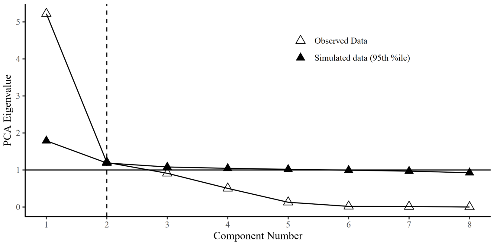
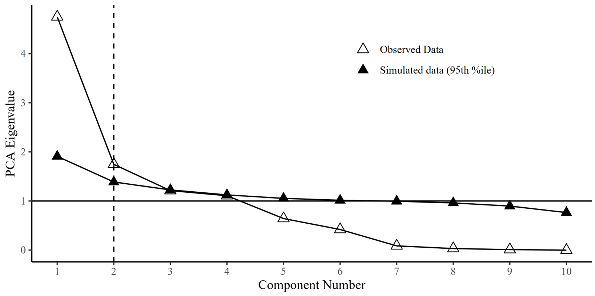
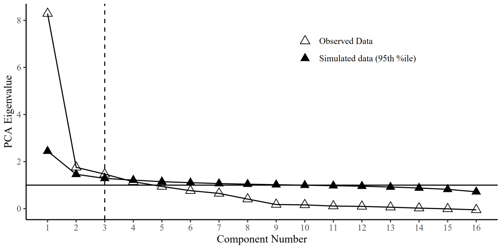
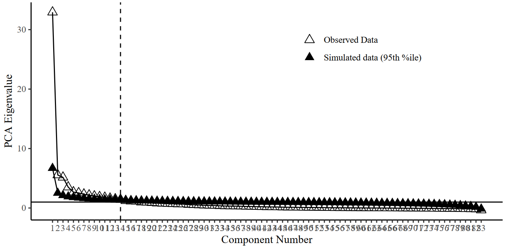

<style>
body{
  font-family: 'Oxygen', sans-serif;
  font-size: 16px;
  line-height: 24px;
}
</style>


```{r setup, include=F,echo=F}
require(knitr)
opts_knit$set(root.dir = "C:/Users/k1894405/OneDrive - King's College London/PhD/Projects/Genomic SEM project/")
knitr::opts_chunk$set(echo = TRUE, fig.align="center")
```

$$\\[0.5in]$$

*Here we calculate descriptive statistics for the brain networks.*

$$\\[1in]$$

***

<br>
<br>

# Phenotyic brain networks

## Eigendecomposition
```{r eigendecomposition_pheno, warning=F,message=F}
# set wd to where region names per network are saved
workingd<-getwd()
temporarywd<-paste0(workingd,"/Scripts/my_own_gwas/2Perform_ldsc")
setwd(temporarywd)

# load files containing region names
central_exec_regions<-read.table("central_executive_areas.txt")$V1
cingulo_regions<-read.table("cingulo_opercular_areas.txt")$V1
default_regions<-read.table("default_mode_areas.txt")$V1
hippocampal_regions<-read.table("hippocampal_diencephalic_areas.txt")$V1
multiple_demand_regions<-read.table("multiple_demand_areas.txt")$V1
p_fit_regions<-read.table("p_fit_areas.txt")$V1
salience_regions<-read.table("salience_areas.txt")$V1
sensori_regions<-read.table("sensorimotor_areas.txt")$V1
temporo_regions<-read.table("temporo_amygdala_orbitofrontal_areas.txt")$V1

# list the files
region_files<-ls(pattern="regions")

# create a dataframe to hold results
library(stringr)
descriptives_pheno_networks<-data.frame(networks=str_replace(region_files,pattern="_regions",replacement = ""))

# load phenotypic correlation matrix
temporarywd_pheno<-paste0(workingd,"/data_my_own/Pheno_preparation/")
setwd(temporarywd_pheno)

load("pheno_decomposition.RData")


for(i in region_files){
  #print(i)
  regions<-get(i)
  
  # get network specific matrix
  matrix<-cor_matrix[regions,regions]

  #calculate eigenvectors, eigenvalues and explained variances
  eigenvectors<-eigen(matrix)$vectors
  eigenvalues<-eigen(matrix)$values
  explained_variance<-round(eigenvalues/sum(eigenvalues)*100,digits = 3)
  #print(explained_variance)
  
  # save explained variance in object "descriptives_pheno_networks" in the appropriate row for each network
  network_name<-str_replace(i,pattern="_regions",replacement = "")
  descriptives_pheno_networks[which(descriptives_pheno_networks$networks == network_name),"R2"]<-explained_variance[1]
  
  # calculate standardised PC loadings 
  stand_loadings<-eigenvectors%*%sqrt(diag(eigenvalues))
  stand_loadings<-stand_loadings[,1]
  
  # switch sign of stand loadings if median is negative
  if(sign(median(stand_loadings))==-1){
    stand_loadings<-stand_loadings*(-1)
  } else {
    stand_loadings<-stand_loadings
  }
  
  # save stand loadings for plot
  name_to_save<-paste0(network_name,"_pheno_loadings")
  assign(name_to_save,stand_loadings)
  
  # calculate mean,sd,median,min,max and save in object
  descriptives_pheno_networks[which(descriptives_pheno_networks$networks == network_name),"mean"]<-mean(stand_loadings)
  descriptives_pheno_networks[which(descriptives_pheno_networks$networks == network_name),"SD"]<-sd(stand_loadings)
  descriptives_pheno_networks[which(descriptives_pheno_networks$networks == network_name),"median"]<-median(stand_loadings)
  descriptives_pheno_networks[which(descriptives_pheno_networks$networks == network_name),"max"]<-max(stand_loadings)
  descriptives_pheno_networks[which(descriptives_pheno_networks$networks == network_name),"min"]<-min(stand_loadings)
  
  #calculate mode
	d<-density(stand_loadings)
	descriptives_pheno_networks[which(descriptives_pheno_networks$networks == network_name),"mode"]<-d$x[which.max(d$y)]
}

# add empty row to descriptives_pheno_networks
descriptives_pheno_networks[nrow(descriptives_pheno_networks)+1,]<-NA
descriptives_pheno_networks[which(is.na(descriptives_pheno_networks$networks)),"networks"]<-"whole_brain"

# eigendecomposition for the whole brain 
eigenvectors<-eigen(cor_matrix)$vectors
eigenvalues<-eigen(cor_matrix)$values
explained_variance<-round(eigenvalues/sum(eigenvalues)*100,digits = 3)
descriptives_pheno_networks[which(descriptives_pheno_networks$networks == "whole_brain"),"R2"]<-explained_variance[1]

# calculate standardised PC loadings 
  stand_loadings<-eigenvectors%*%sqrt(diag(eigenvalues))
  whole_brain_pheno_loadings<-stand_loadings[,1]*(-1)

# descriptive stats for the whole brain 
  descriptives_pheno_networks[which(descriptives_pheno_networks$networks == "whole_brain"),"mean"]<-mean(whole_brain_pheno_loadings)
  descriptives_pheno_networks[which(descriptives_pheno_networks$networks == "whole_brain"),"SD"]<-sd(whole_brain_pheno_loadings)
  descriptives_pheno_networks[which(descriptives_pheno_networks$networks == "whole_brain"),"median"]<-median(whole_brain_pheno_loadings)
  descriptives_pheno_networks[which(descriptives_pheno_networks$networks == "whole_brain"),"max"]<-max(whole_brain_pheno_loadings)
  descriptives_pheno_networks[which(descriptives_pheno_networks$networks == "whole_brain"),"min"]<-min(whole_brain_pheno_loadings)

  #calculate mode
	d<-density(whole_brain_pheno_loadings)
	descriptives_pheno_networks[which(descriptives_pheno_networks$networks == "whole_brain"),"mode"]<-d$x[which.max(d$y)]

kable(descriptives_pheno_networks, digits = 2)
```

<br>

## Plot density distribution of standardised loadings
```{r pheno_PC_plot,warning=F,message=F}
data_pheno<-data.frame(matrix(ncol=2))
colnames(data_pheno)<-c("stand_loadings","network")

rm("regions_pheno_loadings")
loadings_pheno<-ls(pattern="pheno_loadings")
#names<-str_remove(loadings_pheno, pattern="_pheno_loadings")
#data_pheno$network<-names

for(i in loadings_pheno){
  df<-get(i)
  df<-unlist(df)
  #print(df)
  network<-str_remove(i, pattern="_pheno_loadings")
  #print(network)
  df<-cbind(df,network)
  colnames(df)<-c("stand_loadings","network")
  #print(df)
  #assign(i,df)
  data_pheno<-rbind(data_pheno,df)
}

# remove empty first row
data_pheno<-data_pheno[-1,]

# print full names for networks
data_pheno$network[which(data_pheno$network == "temporo")]<-"Temporo-amygdala-orbitofrontal"
data_pheno$network[which(data_pheno$network == "sensori")]<-"Sensorimotor"
data_pheno$network[which(data_pheno$network == "salience")]<-"Salience"
data_pheno$network[which(data_pheno$network == "p_fit")]<-"P-FIT"
data_pheno$network[which(data_pheno$network == "multiple_demand")]<-"Multiple demand"
data_pheno$network[which(data_pheno$network == "hippocampal")]<-"Hippocampal-diencephalic"
data_pheno$network[which(data_pheno$network == "default")]<-"Default mode"
data_pheno$network[which(data_pheno$network == "cingulo")]<-"Cingulo-opercular"
data_pheno$network[which(data_pheno$network == "central_exec")]<-"Central executive"
data_pheno$network[which(data_pheno$network == "whole_brain")]<-"Whole brain"

# adjust data structure
data_pheno$network<-as.factor(data_pheno$network)
data_pheno$stand_loadings<-as.numeric(data_pheno$stand_loadings)

library(ggplot2)
library(RColorBrewer)
library(ggridges)

# Define the number of colors you want
nb.cols <- 10
mycolors <- colorRampPalette(brewer.pal(8, "Pastel1"))(nb.cols)

# save plot

#tiff("PC_pheno_loadings.tiff", width = 6.25, height = 5, units = 'in', res=1000)

 loadings_pheno_plot<-ggplot(data_pheno, aes(x=stand_loadings,y=network))+
              geom_density_ridges(rel_min_height = 0.005, aes(fill=as.factor(network)),stat="density_ridges", position = "identity", quantile_lines =TRUE,na.rm=TRUE, n=nrow(data_pheno)) +
              theme_ridges()+
              #scale_fill_brewer(values = mycolors)+
              scale_fill_manual(values=mycolors,guide=FALSE)+
              scale_x_continuous(n.breaks = 5)+
              xlab("Phenotypic PC loadings")+ylab("")+
              theme(legend.position = "none",
                    axis.text.x = element_text(size=24),
                    axis.text.y = element_text(size=24),
                    axis.title.x = element_text(size=26),
                    panel.background = element_blank(), 
                    axis.line = element_line(color="black"), 
                    axis.line.x = element_line(color="black"))+theme_bw() 
loadings_pheno_plot

#dev.off()
```

Note that the vertical lines indicate quantiles. 


***

<br>
<br>

# Genetic brain networks

## Eigendecomposition
```{r eigendecomp, warning=FALSE,message=F}
### eigen decomposition of networks
rm(list=ls())
library(stringr)
library(data.table)

# set wd where ldsc_output is saved
workingd<-getwd()
temporarywd<-paste0(workingd,"/data_my_own/ldsc/")
setwd(temporarywd)

# list available results in this directory
networks<-list.files(pattern=".RData")
network_names<-str_replace(networks,pattern=".RData",replacement = "")

# load results and name them after their corresponding network
for(i in 1:length(networks)){
  load(networks[i])
  name<-network_names[i]
    if(name == "whole_brain"){
      assign(name,LDSCoutput_wholebrain)
    }else{
      assign(name,LDSCoutput)
    }
}

# name rows and columns in matrices after their corresponding brain area
for(i in network_names){
  output<-get(i)
  dimnames(output$S_Stand)[[1]]<-dimnames(output$S)[[2]]
  dimnames(output$S_Stand)[[2]]<-dimnames(output$S)[[2]]
  name<-i
  assign(name,output)
  output$S_Stand<-round(output$S_Stand,digits = 2)
  name_cor<-paste0("cor_",i)
  assign(name_cor,output$S_Stand)
}

# list matrices of interest
matrices<-ls(pattern="cor_")

#create data frame with names of ldscoutput and names of correlation matrices
networks<-data.frame(cbind(matrices,network_names))

#######################################################
##### networks
#######################################################

for(i in 1:nrow(networks)){
	#### calculate eigenvectors
	# get correlation matrix of interest
	cormatrix<-get(matrices[i])
	
	# extract eigenvectors
	eigenvectors<-eigen(cormatrix)$vectors
	
	# get ldsc_output as it contains correct names (columns named after brain areas)
	noi<-get(network_names[i])
	
	# rename rows and columns with brain areas
	rownames(eigenvectors)<-dimnames(noi$S)[[2]]
	colnames(eigenvectors)<-dimnames(noi$S)[[2]]
	
	# save to network-specific variable name "eigenvectors"
	name<-paste0("eigenvectors_",network_names[i])
	assign(name,eigenvectors)
	
	### calculate eigenvalues
	# extract eigenvalues
	eigenvalues<-eigen(cormatrix)$values
	
	# save to network-specific variable name "eigenvalues"
	name<-paste0("eigenvalues_",network_names[i])
	assign(name,eigenvalues)

	### calculate explained_variances
	explained_variance<-round(eigenvalues/sum(eigenvalues)*100,digits = 3)
	name<-paste0("explained_var_",network_names[i])
	assign(name,explained_variance)
	
	### calculate standardised loadings on first PC
	stand_loadings<-eigenvectors%*%sqrt(diag(eigenvalues))
	stand_loadings<-setDT(as.data.frame(stand_loadings), keep.rownames = TRUE)[,1:2]
	names(stand_loadings)<-c("Regions","stand_loadings")
  
	### flip the loadings if median loadings are negative
	median_loadings<-median(stand_loadings$stand_loadings)
	mean_direction<-sign(median_loadings)
	if(mean_direction == -1){
	stand_loadings$stand_loadings<-stand_loadings$stand_loadings*(-1)
	} else {
	stand_loadings$stand_loadings<-stand_loadings$stand_loadings}

	name<-paste0("stand_loadings_",network_names[i])
	assign(name,stand_loadings)
	}

rm("stand_loadings")
loadings_all_traits<-ls(pattern="stand_loadings")

rm("explained_variance")
explained_all_traits<-ls(pattern="explained_var")

```

#### Save PC loadings in separate files

PC loadings are saved in a separate file to be able to create the network specific summary statistics in a [later step](Hypothesis3.html), in which multiple regions are combined and weighted according to their PC loadings. 

```{r eval=F}

setwd(paste0(workingd,"data_my_own/standardised_loadings/"))

for (i in loadings_all_traits){
	loadings<-get(i)
	file_name<-paste0(i,".txt")
	write.table(loadings,file=file_name,quote=F,sep=" ",na="NA",row.names=F,col.names = T)
}

```


```{r eigendecomp_table}
# display the results in a table
library(knitr)

# create new dataframe with network names in one row
table<-data.frame(networks="test",matrix(nrow=10))[1]
table$networks<-str_replace(loadings_all_traits,pattern="stand_loadings_",replacement="")

for(i in 1:length(loadings_all_traits)){
	
	# store explained var by first PC in every network
	explained<-get(explained_all_traits[i])
	table$explained[i]<-explained[1]
	
	# calculate summary data and store in dataframe
	loadings<-get(loadings_all_traits[i])
	table$min[i]<-min(loadings$stand_loadings)
	table$mean[i]<-mean(loadings$stand_loadings)
	table$sd[i]<-sd(loadings$stand_loadings)
	table$median[i]<-median(loadings$stand_loadings)
	
	#calculate mode
	d<-density(loadings$stand_loadings)
	table$mode[i]<-d$x[which.max(d$y)]	
	
	table$max[i]<-max(loadings$stand_loadings)
	

}

table$number_included<-c(8,10,16,12,12,36,10,12,30,83)


kable(table,caption="Explained variance and loadings on first PC",format="markdown",digits=3,row.names = F)

```


## Plot density distribution of standardised loadings
```{r plot_density_stand_loadings,eval=T,message=F,warning=F}
# all networks are saved in loadings_all_traits

# add a column indicating network name to each df containing standardised loadings and volume names 
# and save all in the same df called data_ridges
data_ridges<-data.frame(matrix(ncol=3))
colnames(data_ridges)<-c("Regions","stand_loadings","network")

for(i in loadings_all_traits){
  df<-get(i)
  name<-str_remove(i, pattern="stand_loadings_")
  df$network<-name
  #assign(i,df)
  data_ridges<-rbind(data_ridges,df)
}

# remove empty first row
data_ridges<-data_ridges[-1,]

# print full names for networks
data_ridges$network[which(data_ridges$network == "temporo")]<-"Temporo-amygdala-orbitofrontal"
data_ridges$network[which(data_ridges$network == "sensori")]<-"Sensorimotor"
data_ridges$network[which(data_ridges$network == "salience")]<-"Salience"
data_ridges$network[which(data_ridges$network == "p_fit")]<-"P-FIT"
data_ridges$network[which(data_ridges$network == "multiple")]<-"Multiple demand"
data_ridges$network[which(data_ridges$network == "hippocampal")]<-"Hippocampal-diencephalic"
data_ridges$network[which(data_ridges$network == "default_mode")]<-"Default mode"
data_ridges$network[which(data_ridges$network == "cingulo")]<-"Cingulo-opercular"
data_ridges$network[which(data_ridges$network == "central_exec")]<-"Central executive"
data_ridges$network[which(data_ridges$network == "whole_brain")]<-"Whole brain"


data_ridges$network<-as.factor(data_ridges$network)

library(ggplot2)
library(RColorBrewer)
library(ggridges)

# Define the number of colors you want
nb.cols <- 10
mycolors <- colorRampPalette(brewer.pal(8, "Pastel1"))(nb.cols)

# save plot

#tiff("PC_loadings.tiff", width = 6.25, height = 5, units = 'in', res=1000)

 loadings_plot<-ggplot(data_ridges, aes(x=stand_loadings,y=network))+
              geom_density_ridges(rel_min_height = 0.005, aes(fill=as.factor(network)),stat="density_ridges", position = "identity", quantile_lines =TRUE,na.rm=TRUE, n=nrow(data_ridges)) +
              theme_ridges()+
              #scale_fill_brewer(values = mycolors)+
              scale_fill_manual(values=mycolors,guide=FALSE)+
              scale_x_continuous(n.breaks = 5)+
              xlab("Genetic PC loadings")+ylab("")+
              theme(legend.position = "none",
                    axis.text.x = element_text(size=24),
                    axis.text.y = element_text(size=24),
                    axis.title.x = element_text(size=26),
                    panel.background = element_blank(), 
                    axis.line = element_line(color="black"), 
                    axis.line.x = element_line(color="black"))+theme_bw() 
loadings_plot

#dev.off()
```

Note that the vertical lines indicate quantiles. 

***

<br>
<br>


## Parallel analysis for genetic networks


We test whether genetic PCs explain more variance than 95% of the corresponding PCs generated under a null model in a parallel analysis. We developed a version of parallel analysis to generate null distributions of eigenvalues by simulating null correlation matrices sampled from a diagonal population matrix, where the multivariate sampling distribution is specified to take the form of the sampling distribution of the standardized empirical genetic correlation matrix (V_Stand = sampling correlation matrix; S_Stand = genetic correlation matrix, as estimated using the ldsc function in GenomicSEM). This sampling correlation matrix (V_stand) serves as an index of the precision of and dependencies among genetic correlations when generating the random null data sets. We specify 1,000 replications to simulate the null correlation matrices and use a 95% threshold for distinguishing true eigenvalues from noise.

```{r parallel_analysis, eval=F,echo=T}
# load dependencies
library(stringr)

# load Javiers function
workingd<-getwd()
temporarywd<-paste0(workingd,"/Scripts/my_own_gwas/Eigendecomp/")
setwd(temporarywd)

source("Parallel_Anallysis_paLDSC_JF.R")

# load data and name it according to network
temporarywd<-paste0(workingd,"/data_my_own/ldsc/")
setwd(temporarywd)

networks<-list.files(pattern=".RData")
network_names<-str_replace(networks,pattern=".RData",replacement = "")

for(i in 1:length(networks)){
load(networks[i])
  name<-network_names[i]
  assign(name,LDSCoutput)
}

temporarywd<-paste0(workingd,"/data_my_own/PA_output/")
setwd(temporarywd)


for(i in network_names){
		ldsc_output<-get(i)
		paLDSC(S_Stand = ldsc_output$S_Stand, V_Stand = ldsc_output$V_Stand, r = 1000, p = .95, diag = F, fa = F, fm = "minres", save.pdf = T)
		name<-paste0("Parallel_analysis_",i,".pdf")
		file.rename("PCA_PA_LDSC.pdf",name)
}
```


<br/>




<br/>




<br/>





<br/>





<br/>


# Exploratory analyses

### The first PC of larger networks explains less variance than the PC of smaller networks

```{r}
volumes<-table$number_included
explained_var<-table$explained


cor.test(volumes,explained_var)
plot(volumes,explained_var,ylab="Explained variance by first PC",xlab="Number of included volumes")
abline(lm(explained_var~volumes),col="red")
```


### Parallel analysis suggests to extract more PCs for larger networks

```{r pa}
networks<-c("central","cingulo","default","hippo","multiple","pfit","salience","sensori","temporo","whole_brain")
volumes<-table$number_included
components<-c(2,2,3,4,2,7,2,2,7,14)

test<-cbind(networks,volumes,components)

cor.test(volumes,components,data=test)
plot(volumes,components,ylab="PCs with eigenvalues above chance",xlab="Number of included volumes")
abline(lm(components~volumes),col="red")
```

## A priori networks explain more variance than networks with randomly included volumes

We added this analysis to formally test whether explained variances by the first underlying PC were larger for a priori networks than they were for networks including random volumes. The simulations are repeated for different amounts of randomly included volumes (800 times each), as the first PC of a network with fewer volumes generally explains less variance compared with networks including more volumes. 

We ask this question, because it may invalidate a priori network characterisations if we obtain the same amounts of explained variances for random network characterisations.


```{r random_networks}
# read in genetic correlation matrix - whole brain 
workingd<-getwd()
temporarywd<-paste0(workingd,"/data_my_own/ldsc/")
setwd(temporarywd)

load("whole_brain.RData")
ldscoutput<-LDSCoutput_wholebrain

# name cells in genetic correlation matrix
dimnames(ldscoutput$S_Stand)[[1]]<-dimnames(ldscoutput$S)[[2]]
dimnames(ldscoutput$S_Stand)[[2]]<-dimnames(ldscoutput$S)[[2]]
ldscoutput$S_Stand<-ldscoutput$S_Stand

# randomly sample brain volumes to be included in a network
all_names<-dimnames(ldscoutput$S)[[2]]

# make table to save output
save_random<-data.frame(matrix(ncol=2))
colnames(save_random)<-c("number_included","random_R2")

# set seed for replicability
set.seed(1234)

# simulate for each number of included volumes in a priori networks
number_included<-c(8,10,12,16,30,36)

# set number of repititions per numver of included volumes
reps<-800

for(j in number_included){
    i<-0

      # repeat reps for each number of included volumes until reps is reached
      repeat{
        i<-i+1

        # determine row to be printed in 
        row<-ifelse(nrow(save_random) == 0, 1,nrow(save_random)+1)

        # save number of volumes included
        save_random[row,"number_included"]<-j 
        
        # randomly select volumes 
        random_names<-sample(all_names, size=j)

        # eigendecomposition
        matrix<-ldscoutput$S_Stand[random_names,random_names]
        eigenvectors<-eigen(matrix)$vectors
        eigenvalues<-eigen(matrix)$values
        random_R2<-(eigenvalues/sum(eigenvalues)*100)[1]
        
        #save in table called save_random
        save_random[row,"random_R2"]<-random_R2
    
          if(i>=reps){
            break
          }
      }
        
}

# calculate statistics per number of included volumes

# mean
results_mean<-aggregate(save_random$random_R2, list(save_random$number_included), mean)
colnames(results_mean)<-c("number_included","random_R2_mean")

#sd
results_sd<-aggregate(save_random$random_R2, list(save_random$number_included), sd)
colnames(results_sd)<-c("number_included","random_R2_sd")
results<-merge(results_mean,results_sd,by="number_included")

#se
results_se<-cbind(number_included=results_sd$number_included, random_R2_se=results_sd$random_R2_sd/sqrt(reps))
results<-merge(results,results_se,by="number_included")

# confidence intervals
results$lower_ci<-with(results, random_R2_mean-(1.96*random_R2_se))
results$upper_ci<-with(results, random_R2_mean+(1.96*random_R2_se))

# round and merge confidence intervals for display
results$lower_ci<-round(results$lower_ci,digits = 2)
results$upper_ci<-round(results$upper_ci,digits = 2)

results$CI<-paste(results$lower_ci,results$upper_ci,sep=" - ")

# merge with empirical results
random_empirical<-merge(results[,c("number_included","random_R2_mean","CI")],table[,c("networks","explained","number_included")],by="number_included")

kable(random_empirical,digits = 2,caption="Mean explained variance and 95% confidence intervals for networks with randomly included volumes")
```


All nine *a priori* networks explain more variance than networks with randomly selected volumes. Comparisons must be made for matching numbers of included volumes (i.e. the 39% explained variance by the central executive network should be compared with the mean explained variance for networks with 8 randomly selected regional volumes).