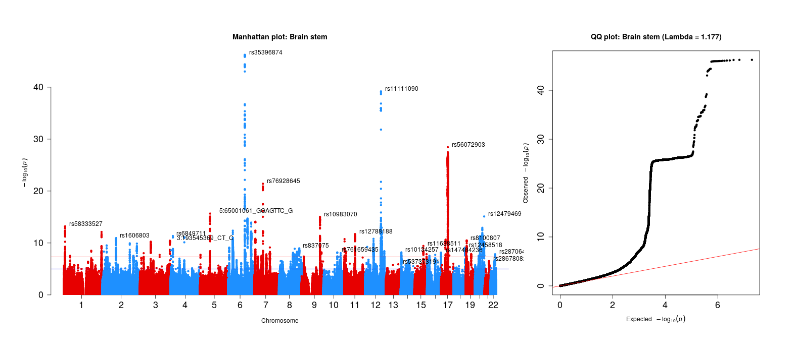
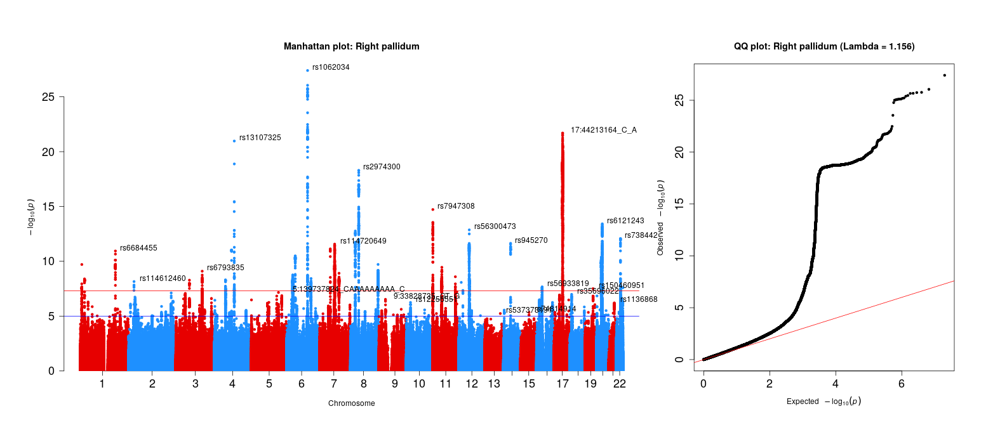
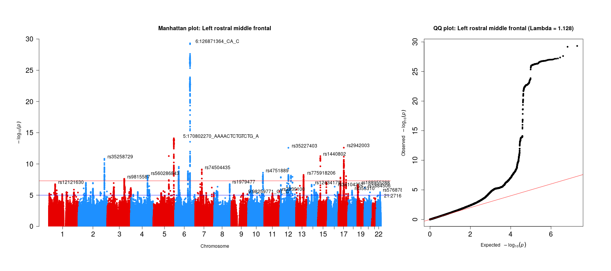

<style>
body{
  font-family: 'Oxygen', sans-serif;
  font-size: 16px;
  line-height: 24px;
}
</style>


```{r setup, include=F,echo=F}
require(knitr)
opts_knit$set(root.dir = "C:/Users/k1894405/OneDrive - King's College London/PhD/Projects/Genomic SEM project/")
knitr::opts_chunk$set(echo = TRUE, fig.align="center")
```

Here, we calculate the genome-wide association study summary statistics for each of our 83 brain volumes. 
The input data used was generated with the code displayed here:

* [Processing phenotypic data](Processing_phenotypic_data.html)

* [Genetic quality control](Genetic_qc.html)

We used the [regenie software](https://rgcgithub.github.io/regenie/options/) for the calculation.


$$\\[0.5in]$$


## Regenie Step 1

```{bash step1, echo=T, eval=F}
#!/bin/bash -l

#SBATCH --mem=16G
#SBATCH --nodes=1
#SBATCH --ntasks=16
#SBATCH --partition brc,shared
#SBATCH --output=~/anna/PhD/output/regenie/step2regenie.out
#SBATCH --job-name=regenie


# set input paths
cleandatapathpheno=~/anna/PhD/output/pheno_preparation/
cleandatapathgeno=~/anna/PhD/output/geno_qc/
ukbpath=/scratch/datasets/ukbiobank/ukb18177/


# set output paths
outputpath=~/anna/PhD/output/regenie/
scriptspath=~/anna/PhD/scripts/regenie/

cd  ${outputpath}

# regenie doesn't like bim files with chrom nums greater than 24
# also I don't need the X chromosome

module load apps/plink/1.9.0b6.10

plink \
--bed ${ukbpath}genotyped/ukb_binary_v2.bed  \
--bim ${ukbpath}genotyped/ukb_binary_v2.bim \
--fam ${ukbpath}genotyped/wukb18177_cal_chr1_v2_s488264.fam \
--chr 1-22 \
--make-bed \
--out ${outputpath}tmp_ukb18177_glanville_binary_pre_qc_no26X

# load regenie module
module load utilities/use.dev
module load apps/regenie/2.0.1-mkl

regenie \
  --step 1 \
  --bed ${outputpath}tmp_ukb18177_glanville_binary_pre_qc_no26X \
  --extract ${cleandatapathgeno}geneticQC_UKB_15042021__MAF0.01_GENO0.02_MIND0.02_CAUC1_UKBQC1_UNREL0.044_HWE0.00000001_SEX1.snplist \
  --phenoFile ${cleandatapathpheno}target_phenotypes_83volumes_gwas.txt \
  --keep ${cleandatapathgeno}geneticQC_UKB_15042021__MAF0.01_GENO0.02_MIND0.02_CAUC1_UKBQC1_UNREL0.044_HWE0.00000001_SEX1.fam \
  --catCovarList sex,batch \
  --maxCatLevels 106 \
  --covarFile ${cleandatapathpheno}covariates_volume_gwas.txt \
  --bsize 1000 \
  --lowmem \
  --lowmem-prefix ${outputpath}tmp_rg \
  --out ${outputpath}fit_out


### This script is an adapted version of Ryan Arathimos' script at https://github.com/applyfun/gwas_methods/blob/main/regenie_gwas_step1.sh

### sbatch -p shared,brc ~/anna/PhD/scripts/regenie/regenie_gwas_step1.sh
```

Note that the plink step prior to step 1 in regenie resulted in another 16,000 SNPs to be removed. Therefore, the final GWAS analysis included 571,257 out of 587,583 directly genotyped SNPs.

<br/>
<br/>

## Regenie Step 2

```{bash step2, echo=T, eval=F}
#!/bin/sh -l

#SBATCH --job-name=regenie_step2
#SBATCH --partition brc,shared
#SBATCH --output=~/anna/PhD/output/regenie/step2/array_regenie.%A_%a.out
#SBATCH --cpus-per-task=8
#SBATCH --mem-per-cpu=8G 
#SBATCH --array=1-22%22


cd ~/anna/PhD/scripts/regenie/

# set input paths
cleandatapathpheno=~/anna/PhD/output/pheno_preparation/
cleandatapathgeno=~/anna/PhD/output/geno_qc/
imputeddata=/mnt/lustre/groups/ukbiobank/ukb18177_glanville/imputed/

# set output paths
outputpath=~/anna/PhD/output/regenie/
scriptspath=~/anna/PhD/scripts/regenie/

# load regenie module and assign array task ID as Chromosome number
echo ${SLURM_ARRAY_TASK_ID}
CHR=${SLURM_ARRAY_TASK_ID}
echo ${CHR} 

module load utilities/use.dev
module load apps/regenie/2.0.1-mkl

regenie \
  --step 2 \
  --bgen ${imputeddata}ukb18177_glanville_imp_chr${CHR}_MAF1_INFO4_v1.bgen \
  --sample ${imputeddata}ukb18177_glanville_chr1.sample \
  --covarFile ${cleandatapathpheno}covariates_volume_gwas.txt \
  --catCovarList sex,batch \
  --maxCatLevels 106 \
  --phenoFile ${cleandatapathpheno}target_phenotypes_83volumes_gwas.txt \
  --keep ${cleandatapathgeno}geneticQC_UKB_15042021__MAF0.01_GENO0.02_MIND0.02_CAUC1_UKBQC1_UNREL0.044_HWE0.00000001_SEX1.fam \
  --bsize 400 \
  --minINFO 0.4 \
  --minMAC 5 \
  --pred ${outputpath}fit_out_pred.list \
  --split \
  --out ${outputpath}step2/regenie_chr_${CHR}_out

echo Done

### This script is an adapted version of Ryan Arathimos' script at https://github.com/applyfun/gwas_methods/blob/main/regenie_gwas_step2.sh

### sbatch -p brc,shared ~/anna/PhD/scripts/regenie/regenie_gwas_step2.sh
```

## Merge regenie output
The regenie software outputs the results for each autosomes separately. The following script merges and formats the 22 autosomes to one file and re-names some of the columns according to naming conventions. 

```{r merge_regenie, eval=F}
#### merge all regenie output files

library(data.table)
library(stringr)

setwd("~/PhD/output/regenie/step2/")

ref<-fread("~/PhD/scripts/pheno_preparation/region_codes.txt",data.table=F)

# test whether all 83 traits have 22 chromosome files assigned to them 
for(i in 1:nrow(ref)){
	num<-length(list.files(pattern=paste0(ref$Region[i],".regenie")))
	print(num)
	if(num != 22) {break}
	
	# save files names for each trait
	file_names<-list.files(pattern=paste0(ref$Region[i],".regenie"))
	vector_name<-paste0(ref$Region[i],"_files")
	print(vector_name)
	assign(vector_name, file_names)
}

# throw an error if we don't end up with 83 files
if(length(ls(pattern="_files")) != 83){"You don't have 83 files"; break}


#######################################################################
# Read in the files for each area and merge them 

all_traits<-ls(pattern="_files")

for(i in all_traits){

trait_files<-get(i)

	# set object to count number of rows to 0
	expected_rows<-0
	
	# read in all files that belong to an area (eg. Brain stem) and save them in dat
	
	num<-length(trait_files)
	dat<-vector("list",num)

			print(paste0("Number of chromosomes read in for ",i))
		for(j in 1:length(trait_files)){
			
			print(j)
			file<-trait_files[j]
			dat[[j]]<-fread(file,header=T,data.table=F)
			
			# calculate number of rows we are expecting in output file
			expected_rows<-expected_rows+nrow(dat[[j]])
			}

	
	# merge the files by all existing columns
	merged_file<-Reduce(function(x,y) merge(x = x, y = y, by = c("CHROM","GENPOS","ID","ALLELE0","ALLELE1","A1FREQ","INFO","N","TEST","BETA","SE","CHISQ","LOG10P"), all=T), dat)
	
	print("Done merging chromosome files")
	
	## Sanity checks: Does the resulting file have the expected dimensions?
	if(nrow(merged_file)!= expected_rows){print("Resulting merged file does not match the expected numeber of rows");break}
	
	if(ncol(merged_file) != 13){print("Resulting merged files does not match the expected number of columns"); break}
	
	print("File has dimensions as expected")
	print(dim(merged_file))
	
	# transform pvalues from log transformation to regular
    # https://www.biostars.org/p/358046/
	merged_file$P<-10^(-merged_file$LOG10P)
	if(min(merged_file$P,na.rm=T)<=0 | max(merged_file$P,na.rm=T) >= 1){"Transformed p-value is out of bounds"; break}
	
	print("Done transform p-value column, and p-values are between 0 and 1")
	
	# rename some of the columns (more intuitive)
	
	names(merged_file)[which(names(merged_file) == "ALLELE0")]<-"OA"
	names(merged_file)[which(names(merged_file) == "ALLELE1")]<-"EA"
	names(merged_file)[which(names(merged_file) == "A1FREQ")]<-"EAFREQ"

	print("Done renaming columns")
	
	# create MAF column
	merged_file$MAF<-ifelse(merged_file$EAFREQ < 0.5, merged_file$EAFREQ, 1-merged_file$EAFREQ))

	print(paste0("This is the file head for ",i))
	print(head(merged_file))
	

	
	# define file name to save the merged file
	region_name<-str_remove(i,pattern="_files")
	filename_print <- paste0("~/PhD/output/regenie/step2/GWAS_22chr_noTBVcontrol_", region_name)
	
					# for testing
					#	assign(region_name,merged_file)
			
	
	# save merged file
	write.table(merged_file, paste0(filename_print,".txt"), sep = "\t", row.names = FALSE, col.names = TRUE)
	
	print(paste0("Done writing file for ", region_name))
}
	

print("Done all traits")
```

## Manhattan and quantile-quantile plot 

For sanity checks of the 83 brain volume gwas, refer to the [next step](Evaluate_gwas.html) of this project. The [qqman package](https://www.biorxiv.org/content/10.1101/005165v1) was used (and slightly modified, see below) to generate these plots.

```{r plots, eval=F}
### Note: 
# I have modified the manhattan function in order to print larger labels for the axes and SNP IDs
# This was not possible just by adding aestetic arguments because "cex = 1" is referred to many times in the function and R doesn't know which incidence to allocate it to
# Therefore, I needed to go in manually and change the cex arguments in the function
# To do that, I copied the manhattan source code from here: https://github.com/stephenturner/qqman/blob/master/R/manhattan.R
# into a separate document called: manhattan_big.R
# modify the cex arguments 
# copy and paste the function into the console
# make sure you load the dependency "calibrate" for the textxy function 
# run the code below to create pngs for each brain volume


#### citation for qqman: Turner, S.D. qqman: an R package for visualizing GWAS results using Q-Q and manhattan plots. biorXiv DOI: 10.1101/005165 (2014).

# load dependencies
library(data.table)
library(qqman)
library(stringr)
library(calibrate)

# set wd to where the gwas files are stored
setwd("/mnt/lustre/groups/ukbiobank/Edinburgh_Data/usr/anna/PhD/output/regenie/step2/")

# list all files of interest
files_of_interest <- list.files(pattern="GWAS_22chr_noTBVcontrol_")


###testing
### file<-fread("GWAS_22chr_noTBVcontrol_Left_accumbens_area.txt", header=T,data.table=F)

for(i in files_of_interest){
	# read in GWAS file
	file<-fread(i, header=T,data.table=F) 
	#file<-file[c(1:1270000),]

	trait_name <- str_remove(i, pattern = "GWAS_22chr_noTBVcontrol_")
	trait_name <- str_remove(trait_name, pattern = ".txt")

	png(filename = paste0("/mnt/lustre/groups/ukbiobank/Edinburgh_Data/usr/anna/PhD/output/",trait_name,".png"), width = 1575, height=700, units="px")
	layout_matrix <- matrix(1:2, nrow = 1, ncol=2)
	layout(layout_matrix,  widths = 2:1) #heights = 1.5:1,
	par(mar=c(5, 4, 4, 2))
	par(oma = c(3,3,3,3))

	# Make MANHATTAN PLOT
	#manhattan(file, chr="CHR",bp="POS",snp="MarkerName",p="P")
	# optional: annotate SNPs with a minimum pvalue, here 0.01 is above the bottom cut-off line
	
	trait_name <- str_replace_all(trait_name, pattern = "_", replacement = " ")

	
	main = paste0("Manhattan plot: ", trait_name)
	manhattan_big(file, main = main, col = c("#e70000","#1E90FF"), chr="CHROM",bp="GENPOS",snp="ID",p="P", annotatePval=0.01, cex.axis = 1.5)

	### Assess systematic bias in GWAS using Genomic Inflation Factor
	chisq <- qchisq(1-file$P,1)
	lambda <- median(chisq)/qchisq(0.5,1)

	# MAKE QQ PLOT
	main <- paste0("QQ plot: ", trait_name, " (Lambda = ",round(lambda,digits=3),")")
	qq(file$P, main = main, cex=1,cex.axis = 1.5)

	dev.off() 
}

#dev.off()

```





