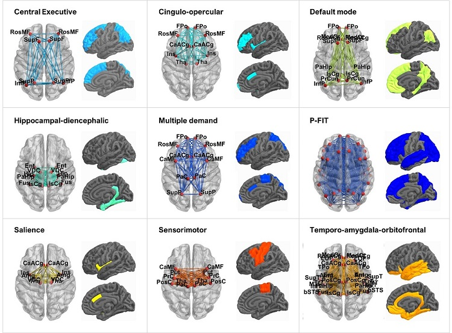

<style>
body{
  font-family: 'Oxygen', sans-serif;
  font-size: 16px;
  line-height: 24px;
}
</style>

```{r, echo=FALSE}
htmltools::img(src = knitr::image_uri(file.path("C:/Users/k1894405/OneDrive - King's College London/PhD/Projects/Genomic SEM project/", "KCL_logo.jpg")), 
               alt = 'logo', 
               style = 'position:absolute; top:60px; right:110px; padding:20px;')
```

***


This website displays analysis code and results from our pre-registered project modeling the genetic structure of *a priori* brain networks.
<br>
For more details on the hypotheses and analysis plan of this project refer to the pre-registration at https://osf.io/7n4qj 


Authors: 

* Anna E. Fürtjes
* James H. Cole
* Simon R. Cox
* Ian J. Deary
* Javier de la Fuente
* Elliot M. Tucker-Drob
* Stuart J. Ritchie


$$\\[0.05in]$$

***

### Analysis steps:

*Code and results are displayed in conjunction.*

* [Processing phenotypic data](Processing_phenotypic_data.html)

* [Genome-wide association study for regional brain volumes](.html)

* [Processing genetic data](Process_genetic_data.html)

* [Descriptive statistics for genetic and phenotypic networks](Descriptive_stats.html)

* [Hypothesis 2 and 1: Comparison of genetic and phenotypic brain measures](Hypothesis2and1.html)

* [Hypothesis 3: Genetic correlation between general cognitive abilities and brain networks](.html)

* [Genetic correlation between brain age and whole-brain shared morphology](.html)

$$\\[0.1in]$$

<center>

{width=100%}
</center>

